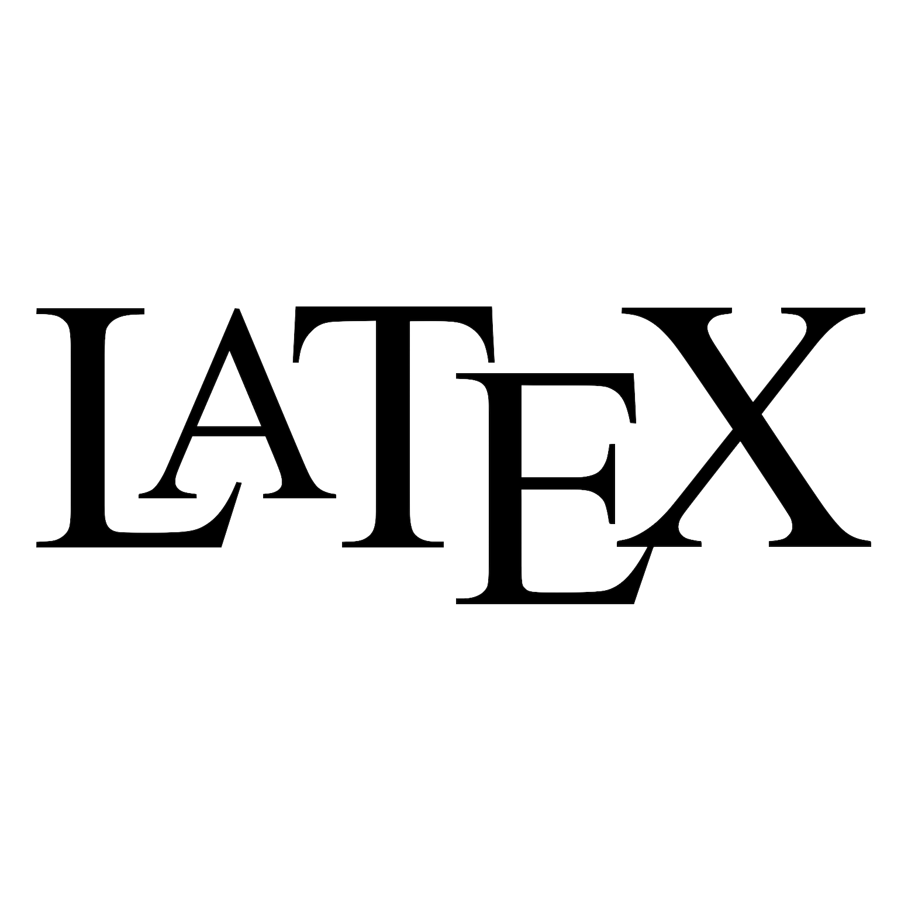

<!-- ### Hi there 👋 -->

<!--
**eliaf2/eliaf2** is a ✨ _special_ ✨ repository because its `README.md` (this file) appears on your GitHub profile.

Here are some ideas to get you started:

- 🔭 I’m currently working on ...
- 🌱 I’m currently learning ...
- 👯 I’m looking to collaborate on ...
- 🤔 I’m looking for help with ...
- 💬 Ask me about ...
- 📫 How to reach me: ...
- 😄 Pronouns: ...
- ⚡ Fun fact: ...
-->

<!-- 
Copyright (C) 2023 Elia Falcioni

This file is licensed under a BSD 3-Clause.

You should have received a copy of the license along with this work. If not, see <https://opensource.org/licenses/BSD-3-Clause>.  

-->
<h1 align="center">Hi 👋, I'm Elia</h1>
<h3 align="center">A Physics student who is learning many things 🚀</h3>

- 🏫 I’m currently studying **Physics** at **Università degli Studi di Camerino**

<!-- - 🔭 I’m currently working on [Progetto](https://github.com/eliaf2/PySerialRNG) -->

- 🌱 I’m currently learning **Physics**, **Eletronics**, **Machine Learning** and **Data Analysis**

- 📫 How to reach me **132740244+eliaf2@users.noreply.github.com**

<h3 align="left">Languages and Tools learned:</h3>

  

 
 
 

<h3 align="left">Currently Learning:</h3>

 </a>  

  
 

 
 

<!-- 

 -->

<!-- 
&nbsp;
 -->

Last Edited on: 12/12/2023